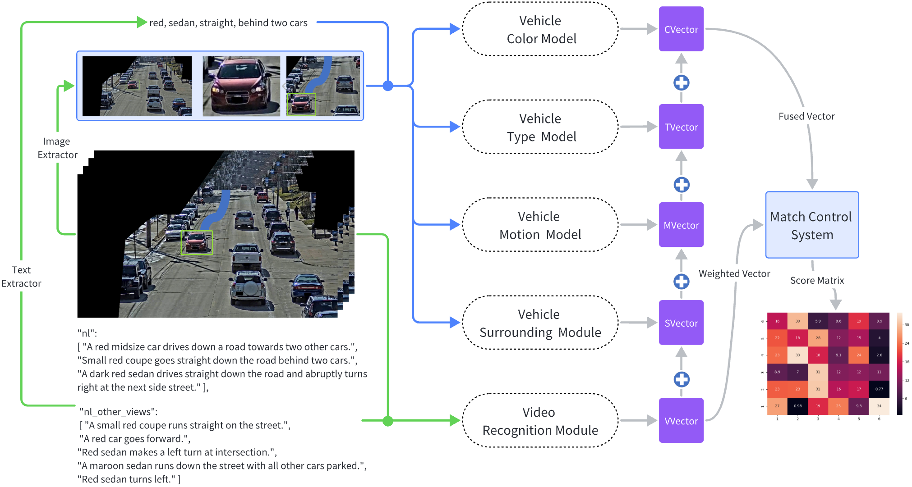

# Multimodal Language Vehicle Retrieval (MLVR)
The code is for our paper in the 7th AI City Challenge Track 2, Tracked-Vehicle Retrieval by Natural Language Descriptions, reaching the 2nd rank on the public leaderboard. 

[A Unified Multi-modal Structure for Retrieving Tracked Vehicles through
Natural Language Descriptions](./docs/paper.pdf)

## Introduction

Through the development of multi-modal and contrastive learning, image and video retrieval have made immense progress over the last years. Organically fused text, image, and video knowledge brings huge potential opportunities for multi-dimension, and multi-view retrieval, especially in traffic senses. This paper proposes a novel Multi-modal Language Vehicle Retrieval (MLVR) system, for retrieving the trajectory of tracked vehicles based on natural language descriptions. The MLVR system is mainly combined with an end-to-end text-video contrastive learning model, a CLIP few-shot domain adaption method, and a semi-centralized control optimization system. Through a comprehensive understanding the knowledge from the vehicle type, color, maneuver, and surrounding environment, the MLVR forms a robust method to recognize an effective trajectory with provided natural language descriptions. Under this structure, our approach has achieved 81.79% Mean Reciprocal Rank (MRR) accuracy on the test dataset, in the 7th AI City Challenge Track 2, Tracked-Vehicle Retrieval by Natural Language Descriptions, rendering the 2nd rank on the public leaderboard. 

<div align="center">
  
</div>

## Requirements
```bash
pip install -r requirements.txt
```


## Structure
```
MLVR
├── data                   # put aicity2023 track 2 data
├── docs                   # pictures and paper
├── preprocessing          # process the data for model
├── model                  # modules for MLVR                 
│   ├── vrm                # Video Recognition Module
│   ├── vct                # Vehicle Color and Type Modules
│   ├── vmm                # Vehicle Motion Module
│   └── vsm                # Vehicle Surrounding Module
├── postprocessing         # Model Postprocessing
│   ├── matrix             # vrm, vct, vmm, vsm score matrices
│   └── final_results.json # submit result 81.79%
├── requirements.txt
└── README.md

```

## Running
### Preprocessing
1. Get images from the video
```bash
cd ./preprocessing
python extract_vdo_frms.py
```
2. Get background of the images
```bash
python generate_median.py
```
3. Generate the video clip for video recognition module
```bash
python create_video_clip.py
```
4. Format the text input for video recognition module
```bash
python create_vrm_data.py
```
5. Crop the vehicle images for vehicle color and type modules
```bash
python crop_vehicle_bbox.py
```
6. Format the text input for vehicle color and type modules
```bash
python create_vct_data.py
```
### Model
1. Video Recognition Module (baseline)
```bash
cd ./model/vrm
sh ./scripts/train.sh # train
sh ./scripts/test.sh  # test
```
Please download the pretrain model [here](https://drive.google.com/drive/folders/19CcSZ-7Hvf0VwiWOes1xr8j499w4TToM?usp=sharing) for test, and put it in `\model\vrm\ckpts\`.

This part is modified from [X-CLIP](https://github.com/xuguohai/X-CLIP).

1. Vehicle Color and Type Modules
```bash
cd ./model/vct
python train.py --config vehicle_color_train.yaml  # vehicle color module train
python test.py --config vehicle_color_test.yaml  #  vehicle color module test

python train.py --config vehicle_type_train.yaml  # vehicle type module train
python test.py --config vehicle_type_test.yaml  #  vehicle type module test
```
This part is modified from [Tip-Adapter](https://github.com/gaopengcuhk/Tip-Adapter).

3. Vehicle Motion Modules
```bash
cd ./model/vmm
python main.py # vehicle color module
```
4. Vehicle Surrounding Modules
```bash
cd ./model/vsm/branch1
python vsm1.py # vehicle surrounding module branch 1

cd ./model/vsm/branch2
python get_candidates.py # vehicle surrounding module branch 2
```
This part is modified from [GLIP](https://github.com/microsoft/GLIP).

### Postprocessing
Run the following command to generate the final submit result 81.79%.
```bash
cd ./postprocessing
python mcs.py # match control system
```